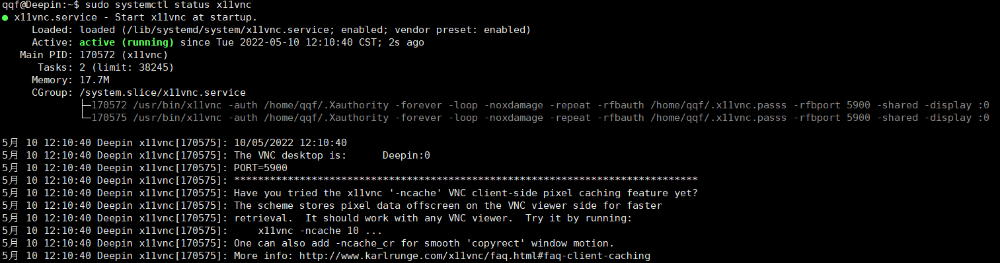
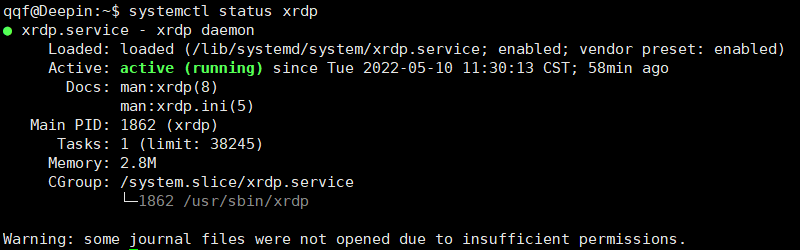

# Deepin配置VNC

环境要求：必须开启ssh

配置步骤：

1. 安装x11vnc

   ```shell
   sudo apt-get install x11vnc
   ```

2. 设置访问密码。密码存储路径可以自行修改

   ```shell
   sudo x11vnc -storepasswd /home/qqf/.x11vnc.pass
   ```

   按照提示完成输入

3. 设置开机启动

   ```shell
   sudo vi /lib/systemd/system/x11vnc.service
   ```

   写入以下内容：

   ```shell
   [Unit]
   Description=Start x11vnc at startup.
   After=multi-user.target
   
   [Service]
   Type=simple
   #ExecStart=/usr/bin/x11vnc -forever -rfbauth /etc/x11vnc.pass -rfbport 5900 -shared
   ExecStart=/usr/bin/x11vnc -auth /home/qqf/.Xauthority -forever -loop -noxdamage -repeat -rfbauth /home/qqf/.x11vnc.passs -rfbport 5900 -shared -display :0
   
   [Install]
   WantedBy=multi-user.target
   ```

   这个设置当中有几个关键点：第一个是`-auth`参数，最好直接找到`.Xauthority`配置文件然后直接指定；第二个是`-display`参数设置为`:0`

4. 设置开机启动

   ```shell
   systemctl enable x11vnc
   systemctl start x11vnc
   ```

   然后查看状态

   ```shell
   systemctl status x11vnc
   ```

   

5. 安装xrdp，并设置开机启动

   ```shell
   sudo apt-get install xrdp
   systemctl enable xrdp
   ```

6. 查看状态

   ```shell
   systemctl status xrdp
   ```

   

然后就可以用windows自带的远程桌面连接deepin了

注意，跳出来的对话框里，session选择`vnc-any`，ip就自己填，password填第2步里填写的password