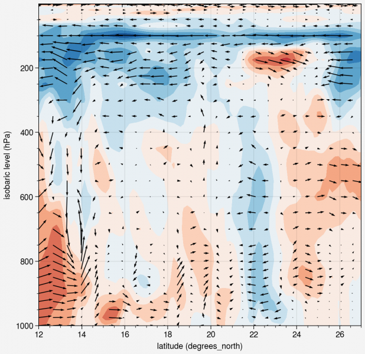
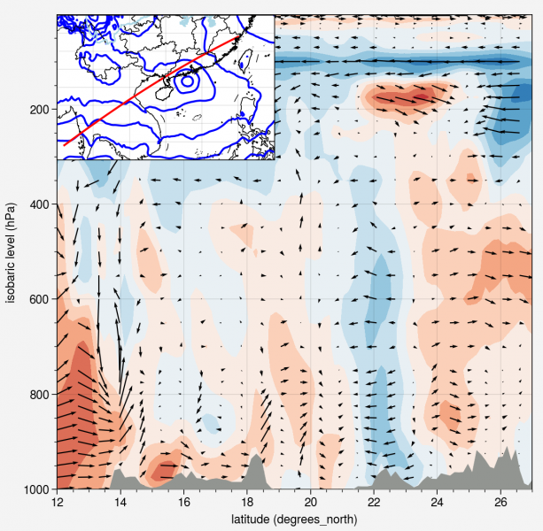

# Python绘制任意两点剖面图

Original 付亚男 [气象家园](javascript:void(0);) *2021-12-22 20:23*

metpy中的cross_section提供了非常便捷的绘制剖面图的方法，具体可见网：

*https://unidata.github.io/MetPy/latest/examples/cross_section.html#sphx-glr-examples-cross-section-py*


如果你只需要简单地画个剖面，那么代码如下：




```python
# %%
import xarray as xr
import proplot as pplt
from metpy.interpolate import cross_section
# %%
era5fnm = r'F:/era5/era5_2021071900_2021072023/era5_2021071900UTC.nc'
era5f = xr.open_dataset(era5fnm)
era5f = era5f.metpy.parse_cf().squeeze()
# %%
# create cross section
start = (12.0, 96.0)
end = (27.0, 120.0)
cross = cross_section(era5f, start, end)
# %%
fig = pplt.figure(
    refwidth = 5.0,
    )
ax = fig.subplot(
    )
# plot cross section
ax.contourf(
    cross['g0_lat_2'],
    cross['lv_ISBL1'][::-1],
    cross['V_GDS0_ISBL'][::-1, :],
    )
ax.quiver(
    cross['g0_lat_2'][::4],
    cross['lv_ISBL1'][::-1],
    cross['V_GDS0_ISBL'][::-1, ::4],
    cross['W_GDS0_ISBL'][::-1, ::4]*10.,
    )
```


如果你想要为剖面添加地形并且显示剖面的平面位置和一些场变量，那么代码如下：




```python
# %%
import xarray as xr
import proplot as pplt
from metpy.interpolate import cross_section
import cartopy.crs as ccrs
import cartopy.feature as cfeat
from cartopy.io.shapereader import Reader
# %%
era5fnm = r'F:/era5/era5_2021071900_2021072023/era5_2021071900UTC.nc'
era5f = xr.open_dataset(era5fnm)
era5f = era5f.metpy.parse_cf().squeeze()
terfnm = r'F:/terrain/dixingdata.nc'
terf = xr.open_dataset(terfnm)
terf = terf.metpy.parse_cf().squeeze()
c = terf['Y'].loc[30:10]
# %%
# create cross section
start = (12.0, 96.0)
end = (27.0, 120.0)
cross = cross_section(era5f, start, end)
tercross = cross_section(terf, start, end)
# %%
fig = pplt.figure(
    refwidth = 5.0,
    )
ax = fig.subplot(
    )
# plot cross section
ax.contourf(
    cross['g0_lat_2'],
    cross['lv_ISBL1'][::-1],
    cross['V_GDS0_ISBL'][::-1, :],
    )
ax.quiver(
    cross['g0_lat_2'][::4],
    cross['lv_ISBL1'][::-1],
    cross['V_GDS0_ISBL'][::-1, ::4],
    cross['W_GDS0_ISBL'][::-1, ::4]*10.,
    )
# plot terrain
oy = ax.alty()
oy.area(
    cross['g0_lat_2'],
    tercross['elev'],
    c = 'grey',
    )
oy.format(
    ylim = (0, 10000),
    yticks = 'none',
    ylabel = '',
    )
# plot inset panel
data_crs = era5f['V_GDS0_ISBL'].metpy.cartopy_crs
ix = fig.add_axes(              # do note that using ax.inset() of proplot will cause a geo stale error
    [0.105, 0.685, 0.4, 0.3],   # thus using fig.add_axes alternatively
    projection = data_crs,
    )
ix.format(
    lonlim = (95, 125),
    latlim = (10, 30),
    )
ix.contour(
    era5f['g0_lon_3'].loc[95:125],
    era5f['g0_lat_2'].loc[10:30],
    era5f['Z_GDS0_ISBL'].loc[850, 10:30, 95:125],
    c = 'blue',
    )
ix.line(
    cross['g0_lon_3'],
    cross['g0_lat_2'],
    c = 'red',
    )
# add geographic information
ix.coastlines()
provinces = cfeat.ShapelyFeature(
    Reader(r'F:/ngcc/bou2_4m/bou2_4l.shp').geometries(),
    ccrs.PlateCarree(), 
    edgecolor='black',
    facecolor='none',
    )
river = cfeat.ShapelyFeature(
    Reader(r'F:/Chinamap-master/cnmap/rivers.shp').geometries(),
    ccrs.PlateCarree(), 
    edgecolor='lightblue',
    facecolor='none',
    )
ix.add_feature(provinces, linewidth=0.5, zorder=2)
ix.add_feature(river, linewidth=1.0, zorder=2)
```

如需以上代码的示例数据文件，请于后台回复 **剖面**


