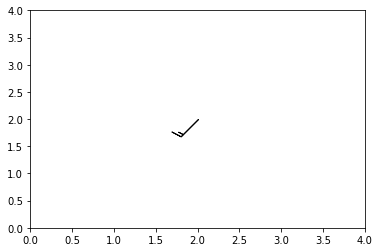
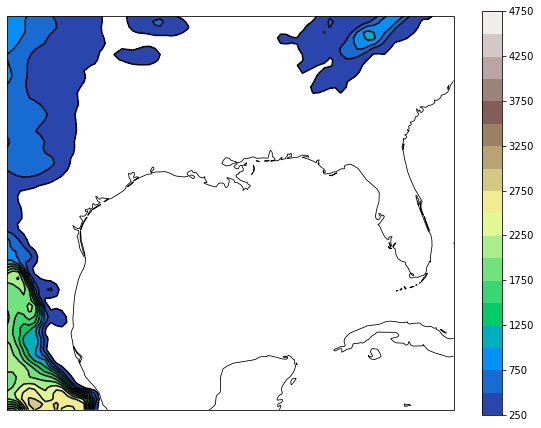
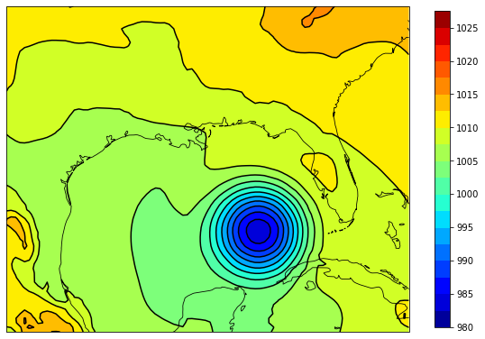
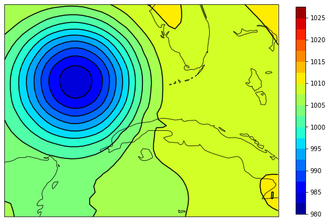
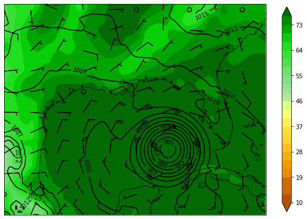
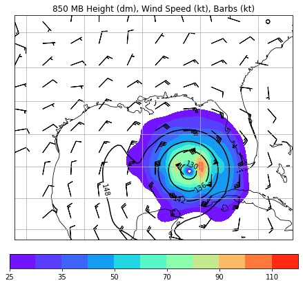
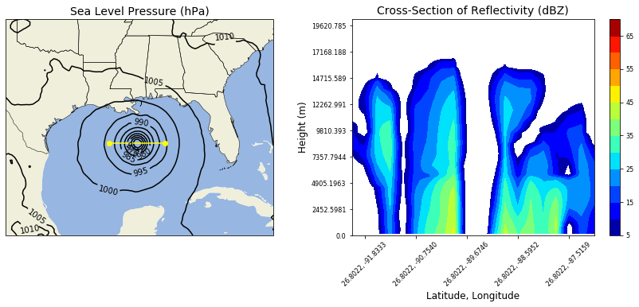

# Python可视化 | WRF模式模拟数据后处理（一）

[MeteoAI](javascript:void(0);) *2021-12-07 10:34*

The following article is from 好奇心Log Author Meteolover

```python
import numpy
import cartopy
from cartopy import crs
from cartopy.feature import NaturalEarthFeature, COLORS
import matplotlib.pyplot as plt
from matplotlib.cm import get_cmap
from matplotlib.colors import from_levels_and_colors
from netCDF4 import Dataset
from xarray import DataArray
from wrf import getvar, interplevel, vertcross,vinterp, ALL_TIMES, CoordPair, xy_to_ll, ll_to_xy, to_np, get_cartopy, latlon_coords, cartopy_xlim, cartopy_ylim
from matplotlib.animation import FuncAnimation
from IPython.display import HTML
import os
import warnings
warnings.filterwarnings('ignore')
WRF_DIRECTORY = "../input/wrf3880"
WRF_FILES = ["wrfout_d01_2005-08-28_00_00_00",
             "wrfout_d01_2005-08-28_12_00_00",
             "wrfout_d01_2005-08-29_00_00_00"]

_WRF_FILES = [os.path.abspath(os.path.join(WRF_DIRECTORY, f)) for f in WRF_FILES]

for f in _WRF_FILES:
    if not os.path.exists(f):
        raise ValueError("{} does not exist. "
            "Check for typos or incorrect directory.".format(f))

def single_wrf_file():
    global _WRF_FILES
    return _WRF_FILES[0]

def multiple_wrf_files():
    global _WRF_FILES
    return _WRF_FILES
```

## **风羽绘制**

```python
u = np.ma.masked_equal(np.zeros((5,5)), 0)
v = np.ma.masked_equal(np.zeros((5,5)), 0)

u[2,2] = 10.0
v[2,2] = 10.0

fig = plt.figure()
ax = plt.axes()
ax.barbs(u, v)
ax.set_xlim(0, 4)
ax.set_ylim(0, 4)

plt.show()
```



## **地形绘制**

```python
file_path = single_wrf_file()
wrf_file = Dataset(file_path)
terrain = getvar(wrf_file, "ter", timeidx=0)
cart_proj = get_cartopy(terrain)
lats, lons = latlon_coords(terrain)

fig = plt.figure(figsize=(10, 7.5))
geo_axes = plt.axes(projection=cart_proj)
states = NaturalEarthFeature(category='cultural', 
                             scale='50m', 
                             facecolor='none',
                             name='admin_1_states_provinces_shp')
geo_axes.add_feature(states, linewidth=.5)
geo_axes.coastlines('50m', linewidth=0.8)
levels = numpy.arange(250., 5000., 250.)
plt.contour(to_np(lons), to_np(lats), 
               to_np(terrain), levels=levels, 
               colors="black",
               transform=crs.PlateCarree())
plt.contourf(to_np(lons), to_np(lats), 
                to_np(terrain), levels=levels,
                transform=crs.PlateCarree(),
                cmap=get_cmap("terrain"))      
plt.colorbar(ax=geo_axes, shrink=.99)
plt.show()
```



## **海平面气压绘制**

```python
file_path = single_wrf_file()
wrf_file = Dataset(file_path)
slp = getvar(wrf_file, "slp", timeidx=0)
cart_proj = get_cartopy(slp)
lats, lons = latlon_coords(slp)
fig = plt.figure(figsize=(10, 7.5))
geo_axes = plt.axes(projection=cart_proj)
states = NaturalEarthFeature(category='cultural', 
                             scale='50m', 
                             facecolor='none',
                             name='admin_1_states_provinces_shp')
geo_axes.add_feature(states, linewidth=.5)
geo_axes.coastlines('50m', linewidth=0.8)
levels = numpy.arange(980.,1030.,2.5)
plt.contour(to_np(lons), to_np(lats), 
            to_np(slp), levels=levels, colors="black",
            transform=crs.PlateCarree())
plt.contourf(to_np(lons), to_np(lats), 
            to_np(slp), levels=levels, 
            transform=crs.PlateCarree(),
            cmap=get_cmap("jet"))         
plt.colorbar(ax=geo_axes, shrink=.86)
plt.show()
```



## **截取特定区域绘制海平面气压**

```python
file_path = single_wrf_file()
wrf_file = Dataset(file_path)
slp = getvar(wrf_file, "slp", timeidx=0)
slp_shape = slp.shape
center_y = int(slp_shape[-2]/2.) - 1
center_x = int(slp_shape[-1]/2.) - 1

slp_quad = slp[..., 0:center_y+1, center_x:]
cart_proj = get_cartopy(slp_quad)
lats, lons = latlon_coords(slp_quad)

fig = plt.figure(figsize=(10, 7.5))
geo_axes = plt.axes(projection=cart_proj)
states = NaturalEarthFeature(category='cultural', 
                             scale='50m', 
                             facecolor='none',
                             name='admin_1_states_provinces_shp')
geo_axes.add_feature(states, linewidth=.5)
geo_axes.coastlines('50m', linewidth=0.8)
levels = numpy.arange(980.,1030.,2.5)
plt.contour(to_np(lons), to_np(lats), 
            to_np(slp_quad), levels=levels, colors="black",
            transform=crs.PlateCarree())
plt.contourf(to_np(lons), to_np(lats), 
            to_np(slp_quad), levels=levels, 
            transform=crs.PlateCarree(),
            cmap=get_cmap("jet"))
plt.colorbar(ax=geo_axes, shrink=.83)
plt.show()
```



## **气压场和相对湿度绘制**

```python
file_path = single_wrf_file()
wrf_file = Dataset(file_path)

slp = getvar(wrf_file, "slp", timeidx=0)
td2 = getvar(wrf_file, "td2", timeidx=0, units="degF")
u_sfc = getvar(wrf_file, "ua", timeidx=0, units="kt")[0,:]
v_sfc = getvar(wrf_file, "va", timeidx=0, units="kt")[0,:]

cart_proj = get_cartopy(slp)
lats, lons = latlon_coords(slp)

fig = plt.figure(figsize=(10, 7.5))
geo_axes = plt.axes(projection=cart_proj)

states = NaturalEarthFeature(category='cultural', 
                             scale='50m', 
                             facecolor='none',
                             name='admin_1_states_provinces_shp')
geo_axes.add_feature(states, linewidth=.5)
geo_axes.coastlines('50m', linewidth=0.8)

slp_levels = numpy.arange(980.,1030.,2.5)
td2_levels = numpy.arange(10., 79., 3.)

td2_rgb = numpy.array([[181,82,0], [181,82,0],
                       [198,107,8], [206,107,8],
                       [231,140,8], [239,156,8],
                       [247,173,24], [255,189,41],
                       [255,212,49], [255,222,66],
                       [255,239,90], [247,255,123],
                       [214,255,132], [181,231,148],
                       [156,222,156], [132,222,132],
                       [112,222,112], [82,222,82],
                       [57,222,57], [33,222,33],
                       [8,206,8], [0,165,0],
                       [0,140,0], [3,105,3]]) / 255.0
    
td2_cmap, td2_norm = from_levels_and_colors(td2_levels, td2_rgb, extend="both")

slp_contours = plt.contour(to_np(lons), 
                              to_np(lats), 
                              to_np(slp), 
                              levels=slp_levels, 
                              colors="black",
                              transform=crs.PlateCarree())

plt.contourf(to_np(lons), to_np(lats), 
                to_np(td2), levels=td2_levels, 
                cmap=td2_cmap, norm=td2_norm,
                extend="both",
                transform=crs.PlateCarree())

thin = [int(x/10.) for x in lons.shape]
plt.barbs(to_np(lons[::thin[0], ::thin[1]]), 
             to_np(lats[::thin[0], ::thin[1]]), 
             to_np(u_sfc[::thin[0], ::thin[1]]), 
             to_np(v_sfc[::thin[0], ::thin[1]]),
             transform=crs.PlateCarree())

plt.clabel(slp_contours, fmt="%i")
plt.colorbar(ax=geo_axes, shrink=.86, extend="both")
plt.xlim(cartopy_xlim(slp))
plt.ylim(cartopy_ylim(slp))
plt.show()
```



## **850hPa气压场和风场绘制**

```python
file_path = single_wrf_file()
wrf_file = Dataset(file_path)

p = getvar(wrf_file, "pressure")
z = getvar(wrf_file, "z", units="dm")
ua = getvar(wrf_file, "ua", units="kt")
va = getvar(wrf_file, "va", units="kt")
wspd = getvar(wrf_file, "wspd_wdir", units="kt")[0,:]

ht_850 = interplevel(z, p, 850)
u_850 = interplevel(ua, p, 850)
v_850 = interplevel(va, p, 850)
wspd_850 = interplevel(wspd, p, 850)
lats, lons = latlon_coords(ht_850)
cart_proj = get_cartopy(ht_850)

fig = plt.figure(figsize=(10,7.5))
ax = plt.axes(projection=cart_proj)
states = NaturalEarthFeature(category='cultural', 
                             scale='50m', 
                             facecolor='none',
                             name='admin_1_states_provinces_shp')
ax.add_feature(states, linewidth=0.5)
ax.coastlines('50m', linewidth=0.8)

levels = numpy.arange(130., 170., 6.)
contours = plt.contour(to_np(lons), 
                          to_np(lats), 
                          to_np(ht_850), 
                          levels=levels, 
                          colors="black",
                          transform=crs.PlateCarree())

plt.clabel(contours, inline=1, fontsize=10, fmt="%i")

levels = [25, 30, 35, 40, 50, 60, 70, 80, 90, 100, 110, 120]
wspd_contours = plt.contourf(to_np(lons), 
                                to_np(lats), 
                                to_np(wspd_850), 
                                levels=levels,
                                cmap=get_cmap("rainbow"),
                                transform=crs.PlateCarree())

plt.colorbar(wspd_contours, ax=ax, orientation="horizontal", pad=.05, shrink=.75)


thin = [int(x/10.) for x in lons.shape]
plt.barbs(to_np(lons[::thin[0], ::thin[1]]), 
          to_np(lats[::thin[0], ::thin[1]]), 
          to_np(u_850[::thin[0], ::thin[1]]),
          to_np(v_850[::thin[0], ::thin[1]]), 
          length=6,transform=crs.PlateCarree())

# Set the map bounds
ax.set_xlim(cartopy_xlim(ht_850))
ax.set_ylim(cartopy_ylim(ht_850))

ax.gridlines()

plt.title("850 MB Height (dm), Wind Speed (kt), Barbs (kt)")

plt.show()
```



## **垂直剖面绘制**

```python
cross_start = CoordPair(lat=26.75, lon=-91.7)
cross_end = CoordPair(lat=26.75, lon=-86.7)

file_path = multiple_wrf_files()
wrf_file = [Dataset(x) for x in file_path]


slp = getvar(wrf_file, "slp", timeidx=-1)
z = getvar(wrf_file, "z", timeidx=-1)
dbz = getvar(wrf_file, "dbz", timeidx=-1)
Z = 10**(dbz/10.) 
z_cross = vertcross(Z, z, wrfin=wrf_file, 
                    start_point=cross_start, 
                    end_point=cross_end,
                    latlon=True, meta=True)

dbz_cross = 10.0 * numpy.log10(z_cross)

lats, lons = latlon_coords(slp)
cart_proj = get_cartopy(slp)

fig = plt.figure(figsize=(15,5))
ax_slp = fig.add_subplot(1,2,1,projection=cart_proj)
ax_dbz = fig.add_subplot(1,2,2)

states = NaturalEarthFeature(category='cultural', scale='50m', facecolor='none',
                             name='admin_1_states_provinces_shp')
land = NaturalEarthFeature(category='physical', name='land', scale='50m',
                           facecolor=COLORS['land'])
ocean = NaturalEarthFeature(category='physical', name='ocean', scale='50m',
                            facecolor=COLORS['water'])


slp_levels = numpy.arange(950.,1030.,5)
slp_contours = ax_slp.contour(to_np(lons), 
                              to_np(lats), 
                              to_np(slp), 
                              levels=slp_levels, 
                              colors="black", 
                              zorder=3, 
                              transform=crs.PlateCarree())

ax_slp.clabel(slp_contours, fmt="%i")

ax_slp.plot([cross_start.lon, cross_end.lon], 
            [cross_start.lat, cross_end.lat],
            color="yellow", 
            marker="o",  
            zorder=3,
            transform=crs.PlateCarree())


ax_slp.add_feature(ocean)
ax_slp.add_feature(land)
ax_slp.add_feature(states, linewidth=.5, edgecolor="black")


dbz_levels = numpy.arange(5.,75.,5.)
dbz_contours = ax_dbz.contourf(to_np(dbz_cross), levels=dbz_levels, cmap=get_cmap("jet"))
cb_dbz = fig.colorbar(dbz_contours, ax=ax_dbz)
cb_dbz.ax.tick_params(labelsize=8)


coord_pairs = to_np(dbz_cross.coords["xy_loc"])
x_ticks = numpy.arange(coord_pairs.shape[0])
x_labels = [pair.latlon_str() for pair in to_np(coord_pairs)]

thin = [int(x/5.) for x in x_ticks.shape]
ax_dbz.set_xticks(x_ticks[1::thin[0]])
ax_dbz.set_xticklabels(x_labels[::thin[0]], rotation=45, fontsize=8)


vert_vals = to_np(dbz_cross.coords["vertical"])
v_ticks = numpy.arange(vert_vals.shape[0])

thin = [int(x/8.) for x in v_ticks.shape]
ax_dbz.set_yticks(v_ticks[::thin[0]])
ax_dbz.set_yticklabels(vert_vals[::thin[0]], fontsize=8)

ax_dbz.set_xlabel("Latitude, Longitude", fontsize=12)
ax_dbz.set_ylabel("Height (m)", fontsize=12)

ax_slp.set_title("Sea Level Pressure (hPa)", {"fontsize" : 14})
ax_dbz.set_title("Cross-Section of Reflectivity (dBZ)", {"fontsize" : 14})

plt.show()
```



## **时空演变绘制（动画与视频）**

```python
file_path = multiple_wrf_files()
wrf_file = [Dataset(f) for f in file_path]
slp_all = getvar(wrf_file, "slp", timeidx=ALL_TIMES)
cart_proj = get_cartopy(slp_all)
fig = plt.figure(figsize=(10,7.5))
ax_slp = plt.axes(projection=cart_proj)
states = NaturalEarthFeature(category='cultural', scale='50m', facecolor='none',
                                      name='admin_1_states_provinces_shp')
land = NaturalEarthFeature(category='physical', name='land', scale='50m',
                                    facecolor=COLORS['land'])
ocean = NaturalEarthFeature(category='physical', name='ocean', scale='50m',
                                     facecolor=COLORS['water'])
slp_levels = numpy.arange(950.,1030.,5.)
num_frames = slp_all.shape[0]

def animate(i):
    ax_slp.clear()
    slp = slp_all[i,:]
    
    lats, lons = latlon_coords(slp)
    
    ax_slp.add_feature(ocean)
    ax_slp.add_feature(land)
    ax_slp.add_feature(states, linewidth=.5, edgecolor="black")
    slp_contours = ax_slp.contour(to_np(lons), 
                                  to_np(lats), 
                                  to_np(slp), 
                                  levels=slp_levels,
                                  colors="black", 
                                  zorder=5,
                                  transform=crs.PlateCarree()) 
    ax_slp.clabel(slp_contours, fmt="%i")
    ax_slp.set_xlim(cartopy_xlim(slp))
    ax_slp.set_ylim(cartopy_ylim(slp))
    return ax_slp


ani = FuncAnimation(fig, animate, num_frames, interval=500)
HTML(ani.to_jshtml())
```

动画在公众号中不太好放，感兴趣的大家可以去和鲸社区上手玩儿一下。代码获取在*好奇心Log*公众号后台回复*wrf绘图1*