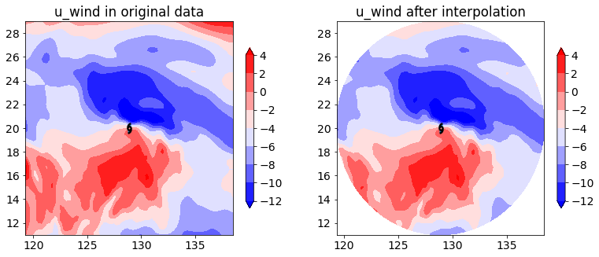

# 使用metpy将台风数据插值转换为极坐标系

**以下全文代码和数据均已发布至\**和鲸社区\**，复制下面链接或者阅读原文前往，可一键fork跑通：**

> https://www.heywhale.com/mw/project/631aa26a8e6d2ee0a86a162b

研究台风的同学们应该都接触过需要计算以台风为中心的方位角平均物理量，这就需要将笛卡尔坐标系中的数据插值到极坐标系，再对各个方位角的数据进行平均。

本项目就是利用metpy里calc这个计算模块，以ERA5数据为例，给定一个台风中心，选取层次为500 hPa，进行插值计算，将数据从笛卡尔坐标系插值为极坐标系，并对两个结果进行对比分析。

# 导入相关库

```
from scipy import interpolate #用来插值
import metpy.calc as mpcalc   #常用气象物理量计算的库
from metpy.units import units  
import xarray as xr   
import numpy as np 
import matplotlib.path as mpath
import matplotlib.pyplot as plt
import matplotlib as mpl
# mpl.rcParams['font.sans-serif'] = ['Times New Roman']#设置默认字体
mpl.rcParams['font.size'] = '14' # 设置字体大小
Warning: ecCodes 2.21.0 or higher is recommended. You are running version 2.14.1
```

# 定义台风符号

```
def get_hurricane():
    u = np.array([ [2.444,7.553],
    [0.513,7.046],
    [-1.243,5.433],
    [-2.353,2.975],
    [-2.578,0.092],
    [-2.075,-1.795],
    [-0.336,-2.870],
    [2.609,-2.016] ])
    u[:,0] -= 0.098
    codes = [1] + [2]*(len(u)-2) + [2]
    u = np.append(u, -u[::-1], axis=0)
    codes += codes
    return mpath.Path(3*u, codes, closed=False)
```

# 读取数据

```
ds = xr.open_dataset('/home/mw/input/nc_sample3575/data_example.nc')
lat = ds.latitude
lon = ds.longitude
```

# 极坐标系插值转换

```
#这边以一个时次、单层为例，lon_t,lat_t是台风中心位置
uwnd = ds.u.sel(level= 500)
lon_t = 128.9
lat_t = 20.0
 
#azimuths是极坐标系中的角度，ranges是半径，可以根据自己需要设置
azimuths = np.linspace(0,360,73)*units.degree
ranges = np.linspace(0,1000,101)*1000*units.meter
 
#利用metpy库可以十分便捷的得到插值后的经纬度坐标
lon_a,lat_a = mpcalc.azimuth_range_to_lat_lon(azimuths,ranges,lon_t,lat_t)
 
#因为ERA5的数据分辨率是0.25°，为了保证插值后不产生NAN，边界上各扩大一个格点
lons = lon[(lon>=lon_a.min()-0.25) & (lon<=lon_a.max()+0.25)] 
lats = lat[(lat>=lat_a.min()-0.25) & (lat<=lat_a.max()+0.25)]
 
#构造插值前的格点矩阵
lon_s,lat_s = np.meshgrid(lons,lats)
grid_in = np.concatenate([lon_s.reshape(-1,1), lat_s.reshape(-1,1)], axis=1)
grid_out = np.concatenate([lon_a.reshape(-1,1), lat_a.reshape(-1,1)], axis=1)
 
#这边以变量u为例，进行插值
u_in = uwnd.sel(longitude=lons,latitude=lats)
u_out = interpolate.griddata(grid_in, np.array(u_in).flatten(), grid_out, method='cubic')
u_out = u_out.reshape((len(azimuths),len(ranges)))
```

# 对比检验

```
#画填色图检验插值数据
plt.figure(1, figsize=(13., 5.))

#插值前的u
ax1 = plt.subplot(121)
ax1.set_title('u_wind in original data')
fig1 = ax1.contourf(lons, lats, u_in, np.arange(-12,6,2), cmap='bwr', extend='both')
plt.scatter(lon_t,lat_t, s=150, marker=get_hurricane(),
    edgecolors="black", linewidth=2.3,zorder=3)
plt.colorbar(fig1,orientation='vertical',shrink=0.75)

#插值后的u
ax2 = plt.subplot(122) 
ax2.set_title('u_wind after interpolation')
fig2 = ax2.contourf(lon_a, lat_a, u_out, np.arange(-12,6,2), cmap='bwr', extend='both')
plt.scatter(lon_t,lat_t, s=150, marker=get_hurricane(),
    edgecolors="black", linewidth=2.3,zorder=3)
plt.colorbar(fig2,orientation='vertical',shrink=0.75)
plt.show()
```



通过上面两张图来看，metpy的极坐标系插值与原坐标系保持一致，插值效果还是十分不错的。

插值后的数据是方位角和半径的函数，后续就可以利用插值后的数据在不同方位角上进行数据分析了。

获取源码和数据请在**「好奇心Log」**公众号后台回复**极坐标**

