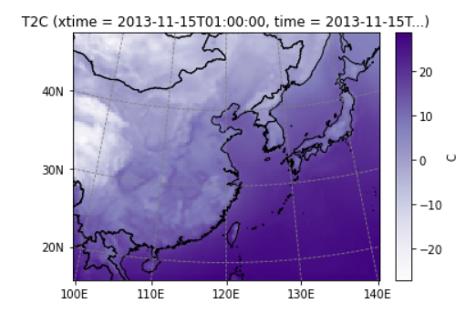
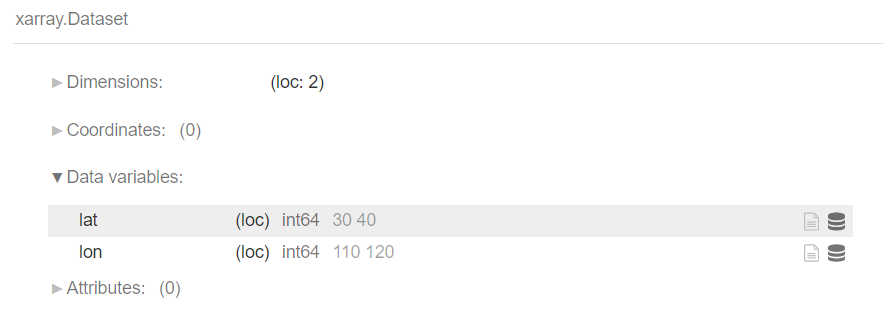
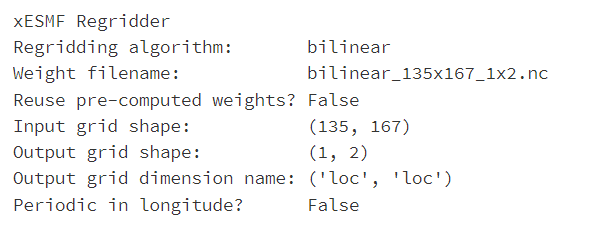
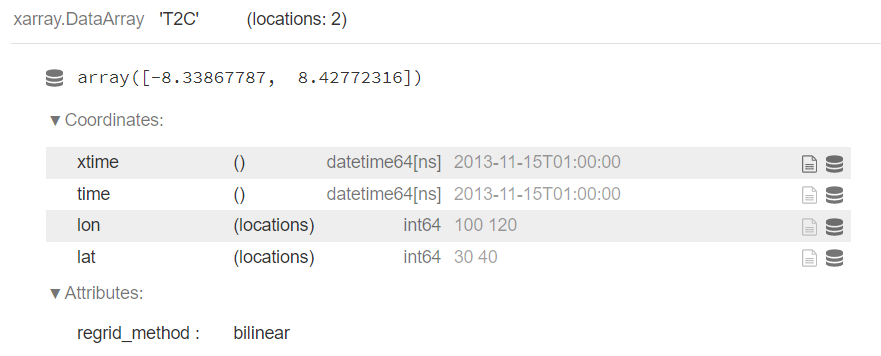
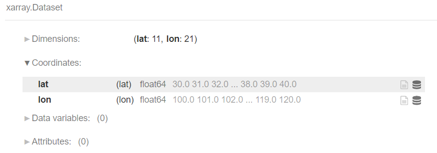
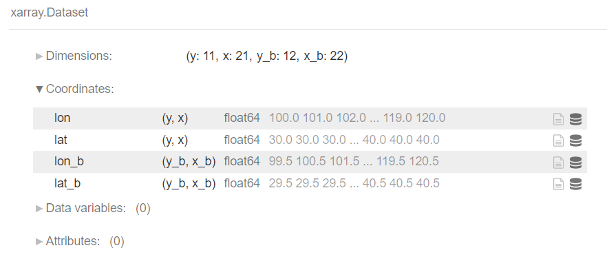
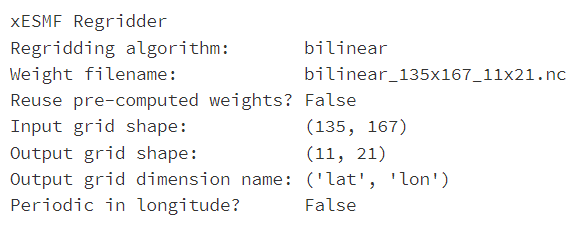
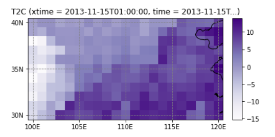

# 利用xesmf将WRF数据插值到站点/网格

Original 蓝胖 [气象备忘录](javascript:void(0);) *2022-09-01 09:48* *Posted on 北京*

**以下全文代码和数据均已发布至\**和鲸社区\**，复制下面链接或者阅读原文前往，可一键fork跑通：**

> https://www.heywhale.com/mw/project/63060e02bcb058bf2ebf2afd


将WRF模拟结果与站点观测或者再分析资料进行对比之前，我们需要对WRF输出的网格资料进行插值（或regrid）

**
**

- ## **读入wrfout数据**

```
import salemimport xarray as xr import xesmf as xeimport numpy as np 
fn = "/home/mw/input/wrfout4973/wrfout_d01_2013-11-15_01_00_00"ds = salem.open_wrf_dataset(fn)ds.T2C.isel(time=0).salem.quick_map(cmap='Purples')
```




- ## **插值到站点**


ESMF LocStream对象描述了一组由经纬度坐标组成的列表，可用于将网格数据插值到观测站点。定义一个地理坐标列表(1-D数组)

```
ds_out = xr.Dataset(    {        "lat": ("loc", [30, 40]),        "lon": ("loc", [100, 120])    })ds_out
```



为LocStream对象创建Regridder时需要设置 locstream_out或locstream_in为True

```
regridder = xe.Regridder(ds, ds_out, "bilinear", locstream_out=True)regridder
```




```
pts = regridder(ds.T2C.isel(time=0))pts
```




- ## **插值到网格**


输出网格可以是一维经纬度网格，而可以是二维经纬度网格


一维：

```
ds_out_1D = xr.Dataset(    {        "lat": ("lat", np.arange(30, 40+1, 1.0)),        "lon": ("lon", np.arange(100, 120+1, 1.0))    })ds_out_1D
```





二维：

```
lons = [100 , 120]lats = [30  ,  40]step = 1ds_out_2D = xe.util.grid_2d(lons[0]-step/2, lons[1]+step/2, step,                         lats[0]-step/2, lats[1]+step/2, step) ds_out_2D
```



```
regridder = xe.Regridder(ds_in = ds, ds_out = ds_out_1D, method = "bilinear")regridder
```




```
grids = regridder(ds.T2C.isel(time=0))grids.salem.quick_map(cmap='Purples')
```




- ## **重复使用权重文件**

```
regridder = xe.Regridder(ds_in = ds, ds_out = ds_out_1D, method = "bilinear")regridder.to_netcdf()
regridder2 = xe.Regridder(ds_in = ds, ds_out = ds_out_1D, method = "bilinear", weights='./bilinear_135x167_11x21.nc')
```


更详细的介绍可以查阅官方手册：

1. https://xesmf.readthedocs.io/en/latest/notebooks/Using_LocStream.html
2. https://xesmf.readthedocs.io/en/latest/notebooks/Rectilinear_grid.html
3. https://xesmf.readthedocs.io/en/latest/notebooks/Curvilinear_grid.html
4. https://xesmf.readthedocs.io/en/latest/notebooks/Reuse_regridder.html

