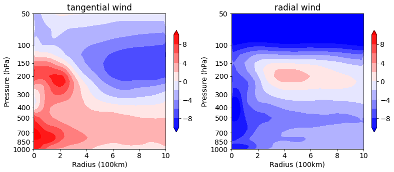

# 可视化 | 台风方位角平均的半径-气压剖面图

[气海同途](javascript:void(0);) *2022-09-16 12:00* *Posted on 北京*

The following article is from 好奇心Log Author 郭好奇同学

**以下全文代码和数据均已发布至\**和鲸社区\**，复制下面链接或者阅读原文前往，可一键fork跑通：**

> https://www.heywhale.com/mw/project/631aad2b8e6d2ee0a86a7f0a

前面的项目[使用metpy将台风数据插值转换为极坐标系](http://mp.weixin.qq.com/s?__biz=MzA3MDQ1NDA4Mw==&mid=2247539038&idx=1&sn=a88e5a6e7aa9588a1a5c0d62006baaa9&chksm=9f3e8772a8490e64bd902a64233c7c4848355b3046c395d52a77bbe04643b1d0428e5431de2c&scene=21#wechat_redirect)中，介绍了如何利用metpy完成将台风数据从笛卡尔坐标系转化成极坐标系的插值操作。

利用插值后的数据进行方位角平均，计算径向风和切向风，对多层数据进行计算后，可以得到方位角平均的半径-气压剖面图。

# 导入相关库

```python
from scipy import interpolate
import metpy.calc as mpcalc  
from metpy.units import units  
import xarray as xr   
import numpy as np 
import matplotlib.pyplot as plt
import matplotlib as mpl
# mpl.rcParams['font.sans-serif'] = ['Times New Roman']#设置默认字体
mpl.rcParams['font.size'] = '14' # 设置字体大小
Warning: ecCodes 2.21.0 or higher is recommended. You are running version 2.14.1
```

# 数据读取

```python
f = '/home/mw/input/nc_sample3575/data_example.nc'
#CMA给出的台风中心
lon_t=128.9
lat_t=20.0

#nc数据读取
ds = xr.open_dataset(f)
lat = ds.latitude
lon = ds.longitude
levels = ds.level
```

# 极坐标系插值转换

```python
 #azimuths是极坐标系中的角度，ranges是半径，可以根据自己需要设置
azimuths = np.linspace(0,360,73)*units.degree
ranges = np.linspace(0,1000,101)*1000*units.meter 
vt_am = np.zeros((len(levels),len(ranges)))
vr_am = np.zeros((len(levels),len(ranges)))

#利用850hPa的相对涡度寻找再分析资料中的台风中心
lon_range = lon[(lon>=lon_t-2) & (lon<=lon_t+2)]
lat_range = lat[(lat>=lat_t-2) & (lat<+lat_t+2)]
vo = ds.vo.sel(level=850, longitude=lon_range, latitude=lat_range)

for m in lat_range:
    for n in lon_range:
        if vo.sel(longitude=n, latitude=m) == np.max(vo):
            lat_v = m
            lon_v = n

#利用metpy库可以十分便捷的得到插值后的经纬度坐标
lon_a,lat_a = mpcalc.azimuth_range_to_lat_lon(azimuths,ranges,lon_v,lat_v)

#因为ERA5的数据分辨率是0.25°，为了保证插值后不产生NAN，边界上各扩大一个格点
lons = lon[(lon>=lon_a.min()-0.25) & (lon<=lon_a.max()+0.25)] 
lats = lat[(lat>=lat_a.min()-0.25) & (lat<=lat_a.max()+0.25)]
lon_s,lat_s = np.meshgrid(lons,lats)
```

# 插值&计算切向风、径向风

```python
#构造插值前后的格点矩阵
grid_in = np.concatenate([lon_s.reshape(-1,1), lat_s.reshape(-1,1)], axis=1)
grid_out = np.concatenate([lon_a.reshape(-1,1), lat_a.reshape(-1,1)], axis=1)

for j in range(0,len(levels)):
    u_in = ds['u'].sel(level= levels[j], longitude=lons, latitude=lats)
    v_in = ds['v'].sel(level= levels[j], longitude=lons, latitude=lats)
    u_out = interpolate.griddata(grid_in, np.array(u_in).flatten(), grid_out, method='cubic')
    v_out = interpolate.griddata(grid_in, np.array(v_in).flatten(), grid_out, method='cubic')
    u_out = u_out.reshape((len(azimuths),len(ranges)))
    v_out = v_out.reshape((len(azimuths),len(ranges)))

    #计算切向风、径向风
    vt = np.zeros((len(azimuths),len(ranges)))
    vr = np.zeros((len(azimuths),len(ranges)))

    for k in range(0,len(azimuths)):
        vt[k,:] = v_out[k,:]*np.cos(azimuths[k]*np.pi/180)-u_out[k,:]*np.sin(azimuths[k]*np.pi/180)
        vr[k,:] = u_out[k,:]*np.cos(azimuths[k]*np.pi/180)+v_out[k,:]*np.sin(azimuths[k]*np.pi/180)
    #计算方位角平均
    vt_am[j,:] = np.mean(vt,axis=0)
    vr_am[j,:] = np.mean(vr,axis=0)
```

# 可视化

```python
#为了图形美观，做2次9点平滑
vt_am = mpcalc.smooth_n_point(vt_am,9,2) 
vr_am = mpcalc.smooth_n_point(vr_am,9,2) 

#画图
plt.figure(1, figsize=(13., 5.))

ax1 = plt.subplot(121) 
ax1.invert_yaxis() 
ax1.set_yscale('symlog')
ax1.set_yticks([1000,850,700,500,400,300,200,150,100,50])
ax1.set_yticklabels([1000,850,700,500,400,300,200,150,100,50])        
ax1.set_xticks(range(0,1200000,200000))
ax1.set_xticklabels(range(0,12,2))
ax1.set_ylabel('Pressure (hPa)')
ax1.set_xlabel('Radius (100km)')
ax1.set_title('tangential wind')
fig1 = ax1.contourf(ranges, levels, vt_am, 
                    np.arange(-10,12,2),
                    cmap='bwr',
                    extend='both')
plt.colorbar(fig1,orientation='vertical',shrink=0.75)

ax2 = plt.subplot(122) 
ax2.invert_yaxis() 
ax2.set_yscale('symlog')
ax2.set_yticks([1000,850,700,500,400,300,200,150,100,50])
ax2.set_yticklabels([1000,850,700,500,400,300,200,150,100,50])        
ax2.set_xticks(range(0,1200000,200000))
ax2.set_xticklabels(range(0,12,2))
ax2.set_ylabel('Pressure (hPa)')
ax2.set_xlabel('Radius (100km)')
ax2.set_title('radial wind')
fig2 = ax2.contourf(ranges, levels, vr_am, 
                    np.arange(-10,12,2),
                    cmap='bwr',
                    extend='both')
plt.colorbar(fig2,orientation='vertical',shrink=0.75)
    
plt.show()   
```



这两张图可以清楚的给出台风切向风与径向风的垂直分布特征。

## 代码&数据获取

获取源码和数据请在**「好奇心Log」**公众号后台回复**方位角平均**

***\**\*本篇内容来自技术大佬金茹投稿\*\**\***