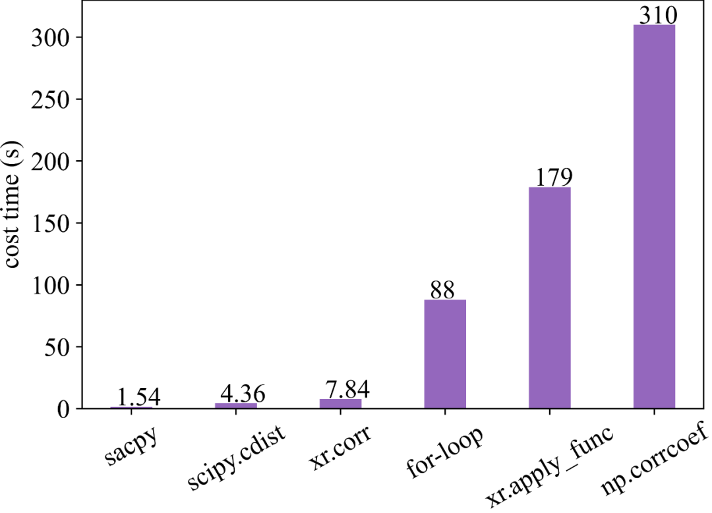
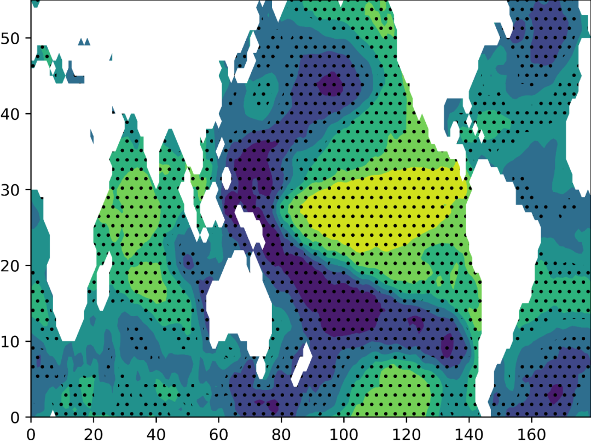
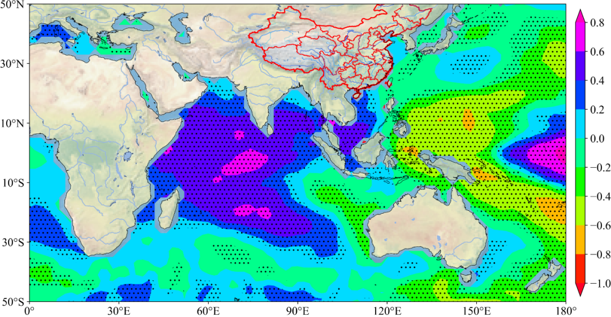
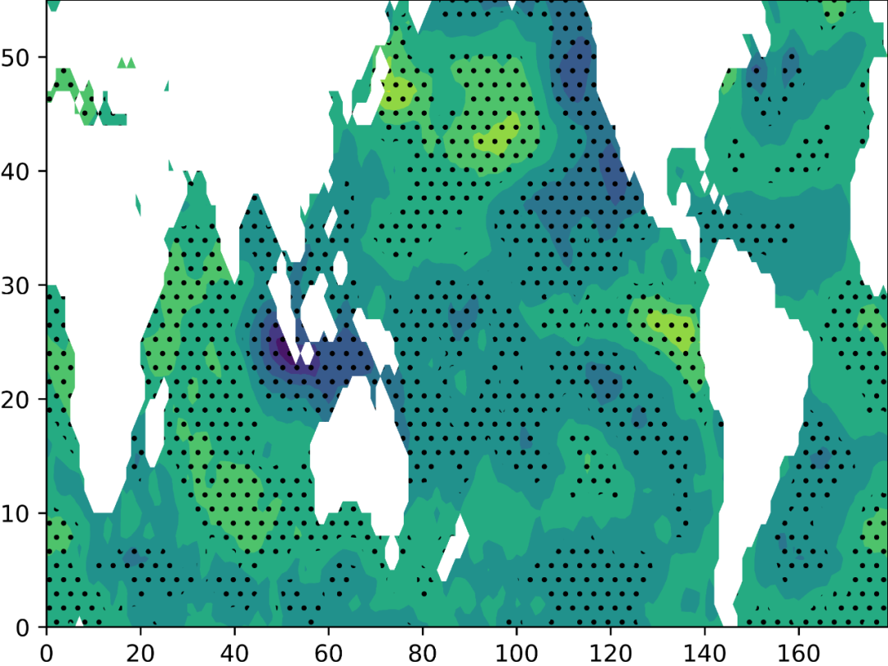
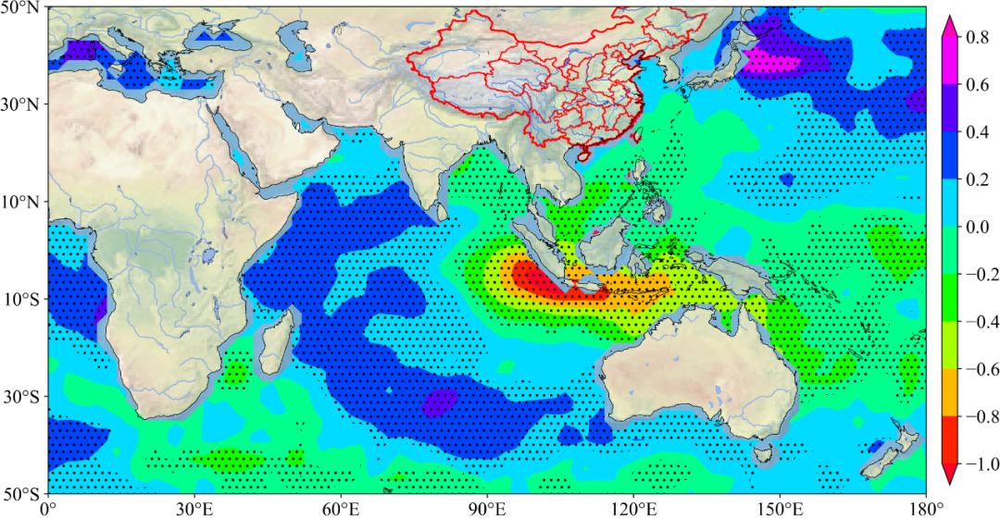
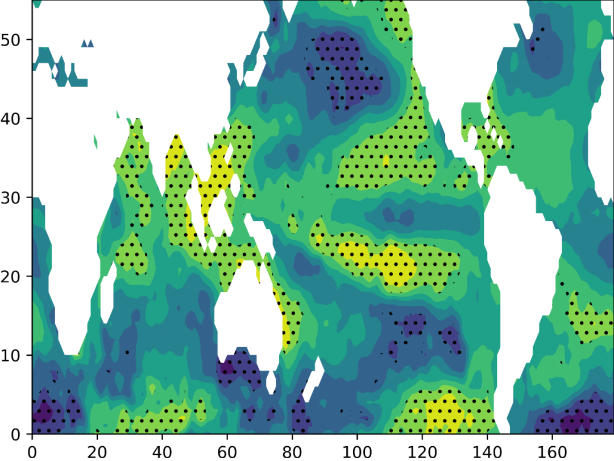
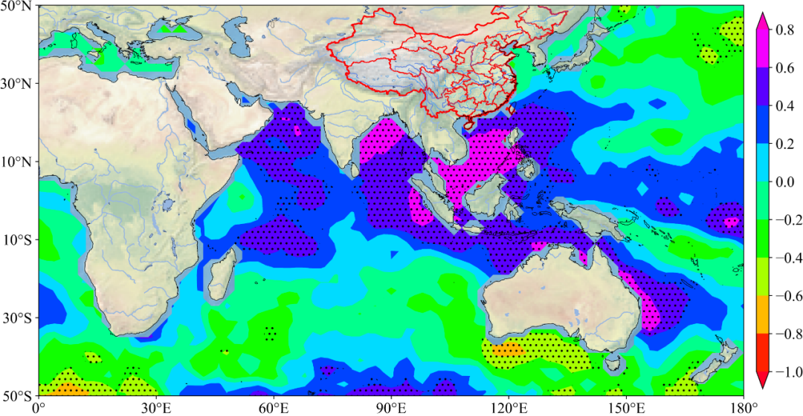

# 气象统计分析库Sacpy

孟子路 [气象学家](javascript:void(0);) *2022-07-27 16:00* *Posted on 湖南*

Sacpy, 一个快速的气候或气象数据的统计分析工具。

e-mail: mzll1202@163.com

github: https://github.com/ZiluM/sacpy

gitee: https://gitee.com/zilum/sacpy

样例或者文档1：

https://github.com/ZiluM/sacpy/tree/master/examples

样例或者文档2：

https://gitee.com/zilum/sacpy/tree/master/examples

pypi: https://pypi.org/project/sacpy/

版本：0.0.9

## **前言：**

作为一个气象学学生和一个Python爱好者，经常苦恼于没有一个好的统计分析python库来加速我的日常学习和科研。正值暑假，我就自己写了一个Python库来完成比如回归（相关）计算、显著性检验等任务。

所有任务都是用Numpy和scipy的矩阵计算完成，所以速度有大幅度的提升。

目前发布的版本只是我测试好的功能，但是我个人的力量毕竟有限，所以存在许多漏洞，请大家多多提出问题。

## **为什么选择Sacpy?**

1.快速！

例如，Sacpy比使用Python的传统回归分析快60倍以上（请参阅Speed test）。

2.为气象气候数据量身定制

与常用的气象计算库（如numpy和xarray）兼容。

## **安装**

使用pip即可安装：

```
pip install sacpy
```

Or you can visit 

https://gitee.com/zilum/sacpy/tree/master/dist to download .

whl file, then

```
pip install .whl_file
```

\##　速度测试

作为比较，我们使用xarray库中的corr函数，在使用numpy库中的corrcoef函数，scipy 库中的cdist函数，xarray库中的apply_func函数和for循环。计算50次SSTA和nino3.4之间的相关系数(see example1)所需的时间如下图所示。



可以看出，我们比scipy cdist快四倍，比xarray.corr快了五倍,比forloop快60倍，比xr.apply_func快了110倍，比numpy.corrcoef快200倍。

而且，xarray.corr,numpy.corrcoef和scipy.cdist不能返回p值。我们可以简单地检查sacpy的pvalue属性来获得p值。

总之，如果我们想要得到p值和相关性或斜率，我们只需要选择Sacpy，比以前使用for loop快60倍。

------

## **实例：**

### **例子1：**

计算全球海温和Nino3.4指数之间的相关系数：

```python
import numpy as np
import scapy as scp
import matplotlib.pyplot as plt
# load sst
sst = scp.load_sst()['sst']
# get ssta (method=1, Remove linear trend;method=0, Minus multi-year average)
ssta = scp.get_anom(sst,method=1)
# calculate Nino3.4
Nino34 = ssta.loc[:,-5:5,190:240].mean(axis=(1,2))
# regression
linreg = scp.LinReg(np.array(Nino34),np.array(ssta))
# plot
plt.contourf(linreg.corr)
# Significance test
plt.contourf(linreg.p_value,levels=[0, 0.05, 1],zorder=1,
            hatches=['..', None],colors="None",)
# save
plt.savefig("./nino34.png")
```





结果如下(详细的绘图过程见examples)

------

### **例子2：**

绘制IOD与全球海温去掉Nino3.4指数影响后的偏回归系数：

```python
import numpy as np
import scapy as scp
import matplotlib.pyplot as plt
# load sst
sst = scp.load_sst()['sst']
# get ssta (method=1, Remove linear trend;method=0, Minus multi-year average)
ssta = scp.get_anom(sst,method=1)
# calculate Nino3.4
Nino34 = ssta.loc[:,-5:5,190:240].mean(axis=(1,2))
# calculate IODIdex
IODW = ssta.loc[:,-10:10,50:70].mean(axis=(1,2))
IODE = ssta.loc[:,-10:0,90:110].mean(axis=(1,2))
IODI = +IODW - IODE
# get x
X = np.vstack([np.array(Nino34),np.array(IODI)]).T
# multiple linear regression
MLR = scp.MultLinReg(X,np.array(ssta))
# plot IOD's effect
plt.contourf(MLR.slope[1])
# Significance test
plt.contourf(MLR.pv_i[1],levels=[0, 0.1, 1],zorder=1,
            hatches=['..', None],colors="None",)
plt.savefig("../pic/MLR.png")
```





结果如下(详细的绘图过程见examples)：

------

### **例子3：**

What effect will ENSO have on the sea surface temperature in the next summer?

```python
import numpy as np
import sacpy as scp
import matplotlib.pyplot as plt
import xarray as xr
# load sst
sst = scp.load_sst()['sst']
ssta = scp.get_anom(sst)
# calculate Nino3.4
Nino34 = ssta.loc[:,-5:5,190:240].mean(axis=(1,2))
# get DJF mean Nino3.4
DJF_nino34 = scp.XrTools.spec_moth_yrmean(Nino34,[12,1,2])
# get JJA mean ssta
JJA_ssta = scp.XrTools.spec_moth_yrmean(ssta, [6,7,8])
# regression
reg = scp.LinReg(np.array(DJF_nino34)[:-1], np.array(JJA_ssta))
# plot
plt.contourf(reg.corr)
# Significance test
plt.contourf(reg.p_value,levels=[0, 0.05, 1],zorder=1,
            hatches=['..', None],colors="None",)
# save
plt.savefig("./ENSO_Next_year_JJA.png",dpi=300)
```





------

Same as **Indian Ocean Capacitor Effect on Indo–Western Pacific Climate during the Summer following El Niño** (Xie et al., 2009), the El Nino will lead to Indian ocean warming in next year JJA.

